### *** UNDER CONSTRUCTION ***

```
This README file is being working on, and is currently an absolute mess.
Please ignore most of what you see here, and try again later.
```

## Video Poker
#### by Jay Ts

### Overview

With the release of version 1.11 in August of 2018, Go came with initial support for WebAssembly, allowing Go to be used for client-side ("front end") web development. WebAssembly allows languages other than JavaScript to control the web browser, and it operates as efficiently-executing native compiled code.

The basic way it works is that the Go compiler produces WebAssembly format rather than a native executable. When the WebAssembly format is loaded by the browser, it is quickly compiled to native machine code and executed.

There are some very good reasons for preferring to use Go instead of JavaScript, including Go's static typing and efficiency. Since it's a compiled language, most programming errors can be caught by the Go compiler, rather than being found only when the program is running and happens to execute the part of code that contains the bug. Go is designed for concurrency, so you will never have to deal with promises and other constructs that have been added to JavaScript to make it useful for modern web programming.

I was curious about the technology, and as I learned more about it, I noticed an overwhelming consensus that WebAssembly will quickly become a very popular and important technology for web development. There are many plans for the technology, and it is being developed rapidly by collaboration involving Mozilla, Google, and others. All of the major browser developers announced support for WebAssembly in 2017, so this is all very new. So does it work?

After waiting nearly two months to read reports from people using the new WebAssembly support and hearing almost nothing, I decided to give it a try. I had a video poker game that I wrote two years ago in C and later translated to both JavaScript and Go. I modified the Go version to be event driven, and then wrote the WebAssembly interface to convert it into a web app.

With Go's WebAssembly support being so new, I expected to have a lot of problems. But I didn't! I was relieved to find that even with just basic package documentation and a few very simple examples to use as a starting point, it wasn't very difficult to get things working, and everything seems to work almost perfectly. If this is what WebAssembly programming in Go is like at the first release, I'm very enthusiastic about its future.

At the current release, Video Poker shows the use of client-side Go to implement an MVC (Model-View-Control) web app. The game engine, in videopoker-web.go, implements the model. View is handled by the WebAssembly interface in main.go that manipulates the DOM, resulting in updates in the web browser, and Control is through mouse clicks and keys typed in the browser window, along with event handling and callbacks in the HTML and the WebAssembly interface in main.go.

This isn't a full test of WebAssembly, but I think it's a good start.

## Release Notes

This is the initial public release of November 2018. The game engine works, and you can see a simple Go/WebAssembly app in action.

To play the game:

http://jayts.com/vp

A description of the game and directions for playing are below.

There are some odd behaviors you may notice in the app:

##### Starting the game

So far, it seems to work well on either Linux or Windows, using a recent version of Firefox, Opera, or Chrome. I'd like to get reports from Mac users. Does it work well on Safari, Chrome, Opera, and Firefox?

Browser support on mobile devices is more limited. You may need to wait some seconds (up to 14 seconds for Firefox on my old tablet) for the game to load. Chrome and Opera seem to work well.

Firefox on mobile is problematic. The app may start properly and work fine the first time the page is loaded, but reloading the page may result in the WebAssembly app not starting. (This is a suspected bug in Go's WebAssembly support or the Firefox browser.) At the worst, you may need to clear the browser cache and restart Firefox to get it to work again. Before that, you can try just restarting the browser, and please let me know if that worked for you.

I don't know about iOS, so if you have an iPhone or iPad, please try it out and report back.

No matter what device, operating system, and browser you are using, I'd like to receive reports of problems. Please let me know what device/OS/browser you are using, and what the problem is.

##### Ending the game

Upon a q ("quit") or e ("exit") keypress, the game shows an end-of-game message,
then just stops and becomes completely unresponsive. That is because the Go program
exited. This is a holdover from the console version, and will work more elegantly
in a future release. (In other words, this is not a problem with Go/WebAssembly.)

For now, reload the page to start a new game.

## The Casino Video Poker Game

Video poker is a popular casino game that is based on five-card draw poker.

The player is dealt five cards, and is allowed to discard any or all of them.
(Actually, the player indicates which cards are to be held.)
The discarded cards are replaced by cards dealt from the deck.
The objective is to obtain a winning hand.
There are nine kinds of winning hands. Each has a different probability, with the amount won increasing with the higher improbablity of the hand.

### This Video Poker Game

It's a great way to practice your strategy for fun, or before going to a casino.

Many variants of video poker are included as options. (Currently accessible only from the keyboard, using the A-I keys.) A few pay better than the default, which is 9/6 Jacks or Better.

### Disclaimer

By default, Video Poker is intended to closely match the behavior of 9/6
Jacks or Better video poker machines in casinos, and an option allows
selection of other games and pay tables. However, the author is not an
expert on gaming, and no guarantee whatsoever is made that Video Poker's
behavior is an exact match to that of any other video poker. Please
take that into careful consideration before trying out a real video
poker machine.

### How to Play Using the Mouse

---

Initally, you may see the following screen:

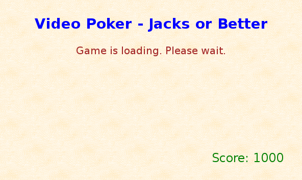

Just wait a few seconds for the game to finish loading. If your device is very old or just plain slow, it may take up to 15 seconds. Modern devices will load the game in less than a second.

---

When the game is fully loaded, you will see this screen

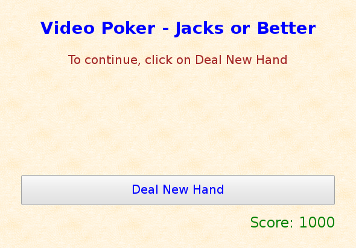

Click on the `Deal New Hand` button to see your first hand.

---

Your score drops by 10 each time you deal a new hand because that's how much you are betting.

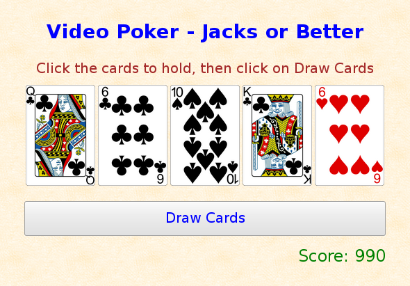

Now you can click on the cards you want to hold onto. A green bar appears underneath each card. If you click again, it will "un-hold" the card, and the green bar disappears.

---

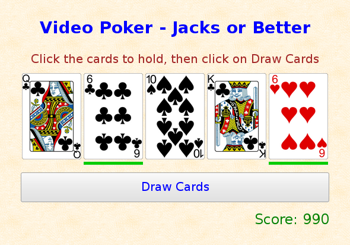

Then click on the `Draw Cards` button to replace the cards you want to discard.

---

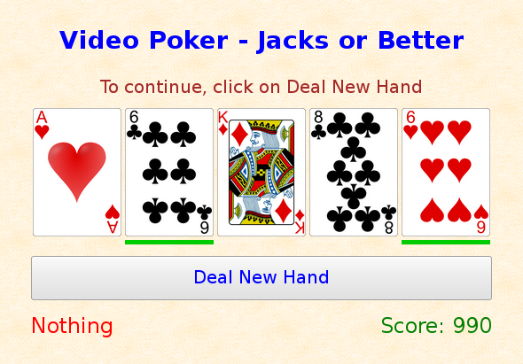

Oh well, this hand didn't win anything. Maybe next time!

---

#### Winning Hands

Here are the nine types of winning hands.

##### Pair

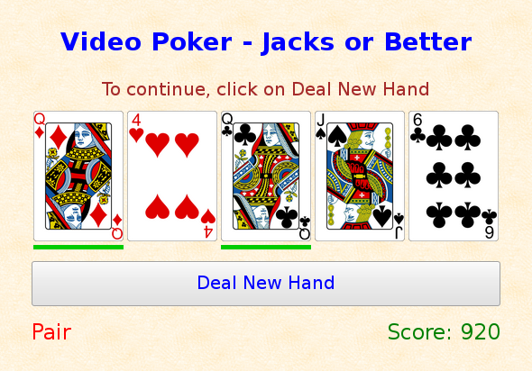

Two cards of the same value. Here, a pair of queens is shown.

Most variants of video poker pay only when the cards are jacks, queens, kings, or aces. Thus the name "Jacks or Better". Tens or Better also pays when the pair is of tens. None of the other hands have this minimal requirement.

The payout for a pair is the same as the amount of your bet. Other hands have larger payouts.

---

##### Two Pair

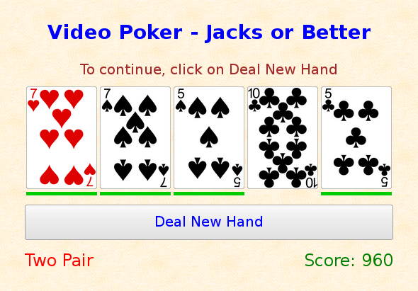

Two different pairs in the same hand. The example shows a pair of 7s and a pair of 5s.

---

##### Three of a Kind

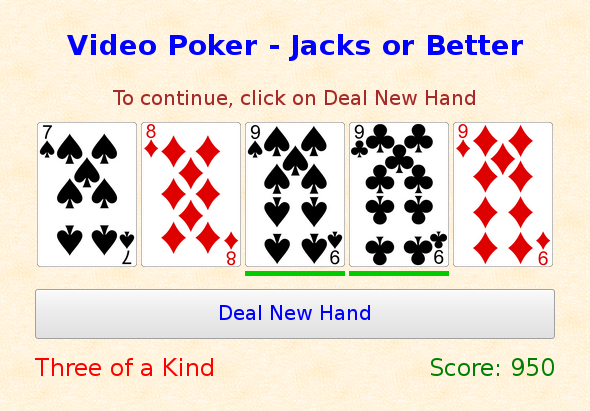

Three cards of the same value. Three 9s is the example shown.

---

##### Straight

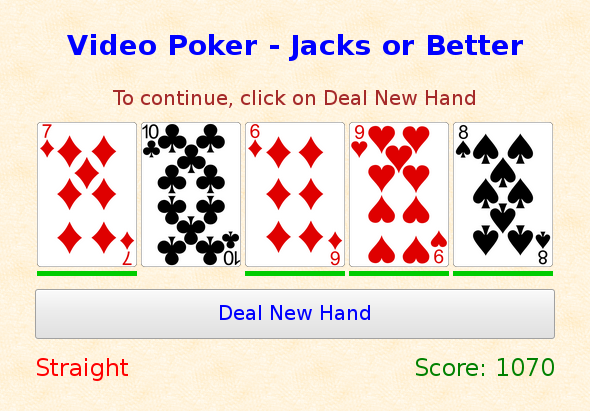

Five cards with consecutive values. In this case, the cards are 6, 7, 8, 9, and 10.

They can be any order in the displayed hand.

An ace can be counted as either one (for example, ace, 1, 2, 3, and 4), or a value above a king. (See the example of a royal flush for that.)

---

##### Flush

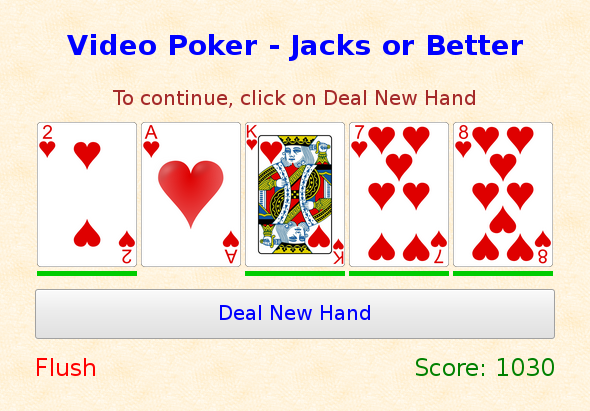

All cards are in the same suit. This hand shows a flush in hearts.

---

##### Full House

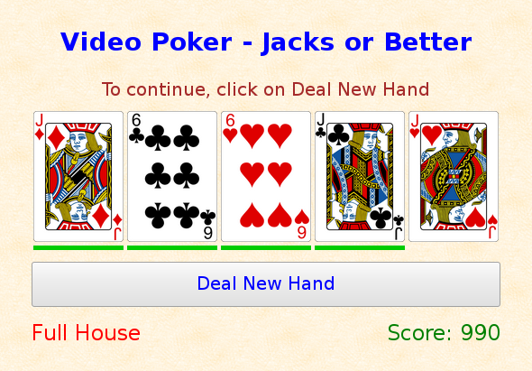

Two cards of one value, and three cards of another value. This hand has 6s and jacks.

---

##### Four of a Kind

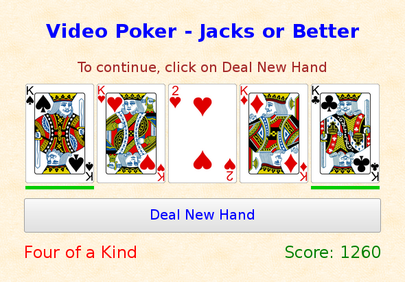

Four cards all of the same value. In this case, kings.

---

##### Straight Flush


The hand is both a straight and a flush. This hand shows a straight flush in clubs, from 5 to 9.

---

##### Royal Flush

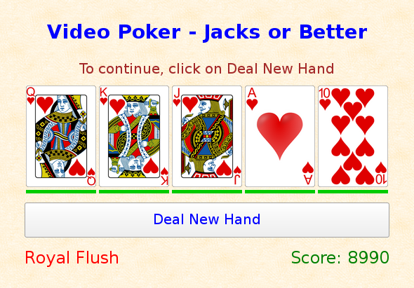

This is simply an ace-high straight flush (10, jack, queen, king, ace). The example shows a royal flush in hearts.

---

### How to Play Using the Keyboard

Start the game and rest the fingers of your right hand on the keyboard
as when touch typing. Your thumb will be on the space bar, and your
index finger through little finger will be on the keys `j`, `k`, `l`, and
semicolon (`;`).

Pressing the Enter (or Return) key does the same thing as clicking
on the wide button below the five cards.

To hold or un-hold cards, type the keys corresponding to the cards:

```
SPACE   Leftmost card
j       Second card from left
k       Middle card
l       Second card from right
;       Rightmost card
```

The keys may be typed in any order, and a key can be entered more than once to toggle the held/discarded state of the card.

Then type the Enter (Return) key to deal. Discarded cards are redealt, and the final hand is shown, along with how it is recognized as either a winning or losing hand, and the new score.

The game will continue until you either quit or run out of chips.

To quit, type either `q` or `e`. Your final score will be displayed. To start a new game, reload the web page.

###### Changing the bet

You may change your bet before a new hand is dealt.
To increase your bet from the default of 10 chips, type a digit from
`1` to `5`, along with the keys to hold cards. For example, typing a `3`
will change your bet to 30 chips.

If the number of chips is less than the bet, the bet is automatically reduced to
make it equal to the number of chips remaining, where it will stay until you change it.

###### Changing the Variant of Video Poker

The default is 9/6 Jacks or Better, but you can change it to another variation of video poker game
by pressing the `A`-`I` keys.

```
    A	All American
    B	Tens or Better
    C	Bonus Poker
    D	Double Bonus Poker
    E	Double Bonus Bonus Poker
    F	9/6 Jacks or Better (default)
    G	9/5 Jacks or Better
    H	8/6 Jacks or Better
    I	8/5 Jacks or Better
```

### How to Play Using the Debug Console

You can also play the game in text mode by opening the browser's Developer Tools and playing in the debug console. Make sure to click in the web page's window (that is, the background behind the cards) to put the keyboard focus there instead of in the debug console window.

### Strategy

There are many websites on the Internet with hints and strategy guides on video poker. Just search for "video poker strategy" or something similar.

### Version

This README is for version 1.0 of the program.

### Author

	Jay Ts
	(http://jayts.com)

### Copyright

	Copyright 2016-2018 Jay Ts

	Released under the GNU Public License, version 3.0 (GPLv3)
	(http://www.gnu.org/licenses/gpl.html)
